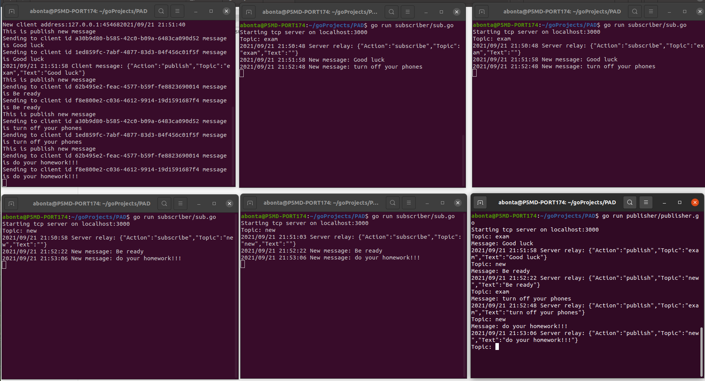

### go pubsub message broker

# Getting started

1) install go https://golang.org/doc/install

2) verify go `go version`

3) install external libraries `go get github.com/satori/go.uuid`

4) run the broker `go run broker/broker.go` or using [run] button in your IDE

5) run the subscriber `go run subscriber/sub.go` or using [run] button in your IDE

6) write the topic in console 

7) run the publisher `go run publisher/publisher.go` or using [run] button in your IDE

8) write the topic and message

## Demo

## References:

[using sockets in go](https://alexeykalina.github.io/technologies/sockets-go.html)

[sent string through socket](https://github.com/Alice-Williams-Tech/go-sockets/tree/v0.1.0)

[sub/pub app + youtube](https://github.com/tabvn/golang-pubsub-youtube)